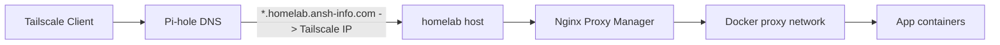

# homelab

This repository is the source of truth for rebuilding and operating my personal homelab. It documents the host layout, Portainer-managed Docker stacks, private networking model, storage paths, and service-to-service dependencies that make the environment work.

The system is private-first. Services are not published individually to the internet. They are reached through Tailscale, resolved by Pi-hole, and routed by Nginx Proxy Manager over a shared Docker network.

## Architecture Summary

The core request flow is:

1. A client joins the tailnet through Tailscale.
2. Pi-hole resolves `*.homelab.ansh-info.com` to the homelab Tailscale IP.
3. The client connects to the homelab host on `80` or `443`.
4. Nginx Proxy Manager reads the hostname and forwards traffic to the correct container on the shared `proxy` network.
5. The target service responds from its internal container port.

Core platform components:

- `Tailscale` for private network access
- `Pi-hole` for internal DNS and wildcard local records
- `Nginx Proxy Manager` for hostname-based routing and TLS
- `Docker` plus `Portainer` for stack deployment and operations
- Shared external Docker network `proxy` for reverse-proxied services

## Current Stack Layout

The main service definitions live under [docker-compose](docker-compose):

- [docker-compose/pihole/docker-compose.yml](docker-compose/pihole/docker-compose.yml)
- [docker-compose/nginx-proxy-manager/docker-compose.yml](docker-compose/nginx-proxy-manager/docker-compose.yml)
- [docker-compose/jellyfin-arr-stack/docker-compose.yml](docker-compose/jellyfin-arr-stack/docker-compose.yml)
- [docker-compose/immich/docker-compose.yml](docker-compose/immich/docker-compose.yml)
- [docker-compose/nextcloud-aio/docker-compose.yml](docker-compose/nextcloud-aio/docker-compose.yml)
- [docker-compose/watchtower/docker-compose.yml](docker-compose/watchtower/docker-compose.yml)

Additional repo content includes dotfiles, editor config, and utility scripts, but the homelab deployment path is centered on the compose files above.

## Rebuild Order

Use this order when rebuilding the machine from scratch:

1. Prepare the Linux host, storage mounts, and baseline packages.
2. Install Docker and Portainer.
3. Install Tailscale and join the machine to the tailnet.
4. Apply firewall rules for the private ingress model.
5. Create the shared external Docker network `proxy`.
6. Prepare stack directories, persistent volumes, and environment files.
7. Deploy Pi-hole.
8. Deploy Nginx Proxy Manager.
9. Restore or recreate internal DNS and proxy host configuration.
10. Deploy application stacks such as Jellyfin/Arr, Immich, Nextcloud AIO, and Watchtower.
11. Run end-to-end verification for DNS, proxy routing, and service health.

## Documentation Map

Start here for the detailed rebuild docs:

- [docs/README.md](docs/README.md)
- [docs/SETUP.md](docs/SETUP.md)
- [docs/NETWORKING.md](docs/NETWORKING.md)
- [docs/CLOUDFLARE.md](docs/CLOUDFLARE.md)
- [docs/OPERATIONS.md](docs/OPERATIONS.md)
- [docs/VARIABLES.md](docs/VARIABLES.md)
- [docs/stacks/portainer.md](docs/stacks/portainer.md)
- [docs/stacks/pihole.md](docs/stacks/pihole.md)
- [docs/stacks/nginx-proxy-manager.md](docs/stacks/nginx-proxy-manager.md)
- [docs/stacks/jellyfin-arr-stack.md](docs/stacks/jellyfin-arr-stack.md)
- [docs/stacks/immich.md](docs/stacks/immich.md)
- [docs/stacks/nextcloud-aio.md](docs/stacks/nextcloud-aio.md)
- [docs/stacks/watchtower.md](docs/stacks/watchtower.md)

## Repository Layout

- [docker-compose](docker-compose): Portainer stack definitions and service-specific compose files
- [utils](utils): helper scripts
- [docs](docs): rebuild and operations documentation

## Operating Model

- Primary deployment workflow: `Portainer stacks`
- Secondary fallback workflow: `docker compose` and direct `docker` CLI commands for inspection and recovery
- Internal DNS pattern: wildcard records under `*.homelab.ansh-info.com`
- Access pattern: Tailscale only, with `53`, `80`, and `443` allowed on `tailscale0`

## Status

- Core private ingress path is working through Tailscale, Pi-hole, and NPM.
- Major services are defined as separate compose stacks for easier redeploy and troubleshooting.
- Documentation is being rewritten to make rebuilds deterministic and repeatable.
